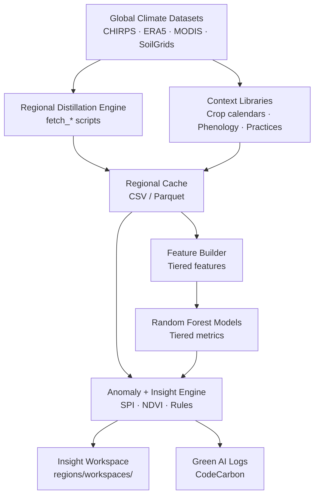

# 🌍 Situated Insight — Regional Climate Agent Pilot
**Reproducible, open, and locally meaningful climate intelligence**

The *Situated Insight* project shows how lightweight, reproducible AI systems can distill global climate data into **locally relevant insights** — helping land stewards, cooperatives, and researchers work from the same context without requiring massive compute power or centralized servers.

Our pilot demonstrates that **climate intelligence can be both green and grounded**: localized, transparent, and powered by CPU-only pipelines that anyone can re-run.

---

## 🧠 Concept Overview
Each regional agent acts as a **self-contained, evolving climate insight engine**, built around the principle that global climate data should *adapt to place*.  
The system turns high-volume, high-latency global datasets into *regional learning capsules* — small, fast, transparent models that continuously improve through local enrichment.

Each capsule follows five core steps:

1. **Data Distillation** – Convert terabyte-scale sources (CHIRPS, ERA5, MODIS) into lightweight local datasets.  
2. **Feature Computation** – Extract interpretable signals (SPI, GDD, NDVI, VPD) that directly reflect field conditions.  
3. **Context Fusion** – Blend those signals with regional or crop-specific data for grounded analysis.  
4. **Random Forest Modelling** – Train region-tuned ensemble models that capture local climate–crop dynamics and can be recombined into a *global mesh of interpretable regional models*.  
5. **Agent Reasoning & Insight Feed** – Translate outputs into contextual summaries and threshold-based alerts — usable by cooperatives, dashboards, or DAO networks.

Together, these local engines form a **“mosaic” of regional intelligence** — a decentralized climate-learning network that grows by recombining local models, rather than scaling centralized compute.

---

## ♻️ Green AI Design
Green AI here doesn’t just mean *energy efficient*.  
It means **computationally regenerative** — maximizing insight per watt, per byte, per decision.  
The system’s design reduces both *climate modeling waste* and *decision latency* through three interlocking strategies:

1. **Local Distillation for Global Efficiency**  
   → Instead of repeatedly processing petabytes of reanalysis data, each region runs a one-time distillation — caching rainfall, temperature, and NDVI locally in compact, open formats (CSV/Zarr).  
   → This creates “climate slides” that can be reused, versioned, and extended across years or projects without rerunning full downloads.

2. **Composable Regional Models**  
   → Random Forests trained in each region are small enough to run on CPUs, yet collectively form a *distributed ensemble* — a green, federated alternative to energy-hungry large models.  
   → They can be merged, compared, or retrained incrementally to build a global climate-learning network without centralized compute or cloud lock-in.

3. **Human–Machine Efficiency Loop**  
   → Every model serves a *decision-support function* — not abstract prediction.  
   → Farmers, DAOs, or research networks get immediate insight: “this rainfall anomaly aligns with below-normal NDVI recovery,” creating feedback that improves adaptation strategies *and* future training data.

The result is a system that turns global climate data into *regional intelligence assets* — **small, composable, human-useful models that waste nothing**: not data, not compute, not insight.

---

## 🧩 Pilot Regions

| Region | Context | Focus |
|--------|----------|--------|
| 🇭🇺 **Transdanubia Wheat Belt** | Temperate, mixed cropping | Climate variability and soil moisture response |
| 🇯🇲 **Jamaica Coffee Belt** | Tropical, high-elevation | Shade dynamics and rainfall anomalies |

---

## 🌐 Regional Insight Mesh
The long-term vision is a **network of regional agents**, each acting as a “climate node” trained on localized data, yet interoperable through shared metadata and features.

- Each region distills global datasets into its own **climate cache** — CHIRPS rainfall, ERA5 reanalysis, NDVI composites, and local context.  
- Each cache trains its own lightweight Random Forest model, producing interpretable regional logic.  
- These regional models can then be **linked or aggregated** into a *global insight mesh* — a distributed knowledge fabric that learns through connection and reuse.  

This architecture enables:
- **Energy reduction** through one-time regional computation and long-term reuse.  
- **Participatory enrichment** by allowing cooperatives and researchers to contribute local data or retraining triggers.  
- **Interoperability** between models, where shared climate and practice features can be queried like microservices.  

The mesh expands through regional connection and reuse, forming a **planetary network of small, efficient climate AIs** whose combined insight grows with every new region added.

---

## ⚙️ Architecture



---

## 🧭 Setup & Reproducibility

> Recommended Python version: **3.11+** (tested on Kaggle CPUs and GitHub Actions runners).

### 1. Clone & install

```bash
git clone https://github.com/itsmoagain/regional-agent-hack.git
cd regional-agent-hack
pip install -r requirements.txt
```

### 2. Authenticate data sources (one time)

Some fetchers rely on Google Earth Engine (GEE). From the repo root run:

```bash
python scripts/gee_setup.py --project <your_gee_project>
```

The command prints the OAuth URL you must visit. Paste the token back into the terminal and the credentials will be cached under `~/.config/earthengine/`.

### 3. Launch the region wizard

```bash
python scripts/setup_new_region.py
```

The wizard collects:

1. Region key (e.g. `hungary_transdanubia`).
2. Bounding box (`min_lon min_lat max_lon max_lat`).
3. Crop selection (from `config/crop_library.yml`).
4. Optional practice log metadata.

It scaffolds:

- `regions/profiles/insight.<region>.yml` (extending `insight.defaults.yml`).
- `regions/workspaces/<region>/` workspace for interactive agent runs.
- `data/<region>/` directories.
- Cached phenology templates derived from the crop library.

### 4. Build the climate cache

```bash
python scripts/build_region_cache.py --region <region_key>
```

The cache builder will:

- Reuse any existing CSVs in `data/<region_key>/`.
- Auto-fetch missing datasets with CPU-only fetchers:
  - `fetch_chirps_gee.py` (precipitation)
  - `fetch_soil_gee.py` (surface/root-zone moisture)
  - `fetch_ndvi_gee.py` (MODIS NDVI)
  - `fetch_openmeteo.py` (temperature baselines)

Outputs land in `daily_merged.csv` and `monthly_merged.csv`, with provenance logged in `metadata.json`.

### 5. Generate insights & models

```bash
python scripts/build_region_insights.py --region <region_key>
python scripts/train_region_model.py --region <region_key> --tier 2 --freq monthly
python scripts/flag_anomalies.py --region <region_key>
```

If you run the onboarding wizard (`python scripts/setup_new_region.py`) these commands are executed automatically: once the
cache is ready the wizard calls `build_region_insights.py`, which emits `data/<region_key>/insights_daily.csv` (when daily data exists)
or `insights_monthly.csv`. The reference regions bundled in `regions/profiles/insight.hungary_transdanubia.yml` and
`regions/profiles/insight.jamaica_coffee.yml` therefore produce their insight tables immediately, exactly as a user-specified AOI would.

`train_region_model.py` now adapts to both the legacy `insight_*.csv` naming and the new `insights_*.csv` format. Feature builds are tiered (core climate → +phenology → +context) and the Random Forest artifacts are stored under `models/<region_key>/` with feature importances and metrics JSON.

Every automated step also mirrors key artifacts into `regions/workspaces/<region_key>/` so you have a clean, dedicated sandbox for dashboards, notebooks, or further agent experimentation without touching the canonical data cache.

### 6. Track Green-AI runs

For Hackathon submissions include paired *baseline* and *optimized* runs. Use `engine/evaluate_greenai.py` to wrap the command you are profiling:

```bash
python engine/evaluate_greenai.py --region <region_key> --command "python scripts/train_region_model.py --region <region_key> --tier 2"
```

The wrapper records `runtime_sec`, `energy_kwh` (CodeCarbon proxy), hardware, and `co2e_kg` so you can compose the before/after summary required by the competition rubric.

### 7. Notebook reproduction

Kaggle- or Devpost-ready walkthroughs live in `notebooks/pipeline_demo.ipynb`. Switch the `REGION` variable between `hungary_transdanubia` and `jamaica_coffee` to demonstrate reproducibility across both flagship AOIs.

---

## ✳️ Credits
**Developed by Morgan Urich**  
Hack4Earth Green AI Olympiad 2025 – Budapest  
*Reproducible, ethical, and locally grounded climate computation.*
